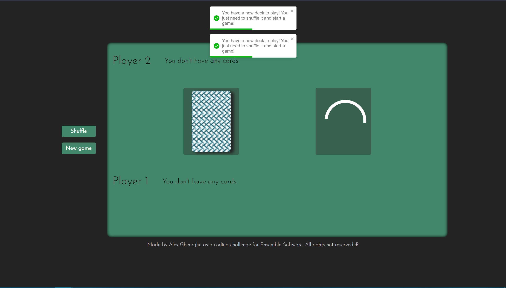
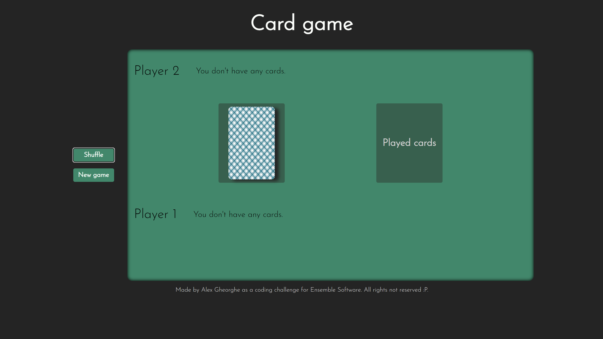
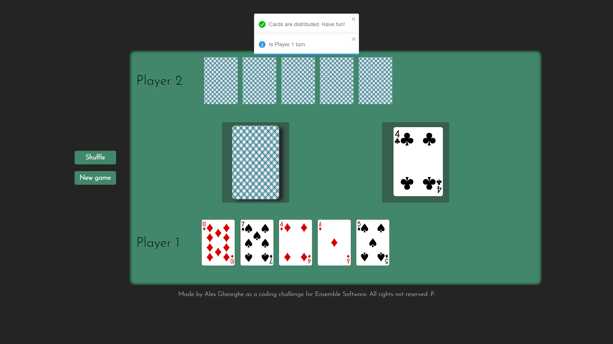
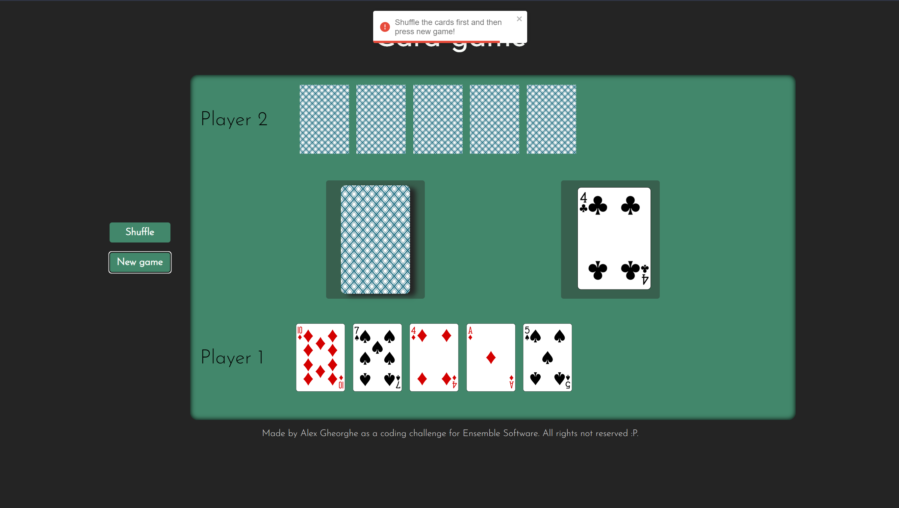
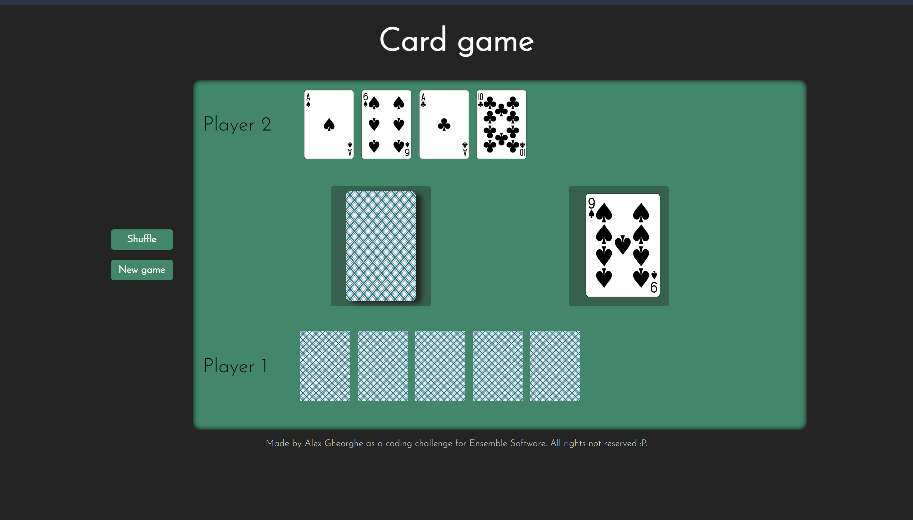
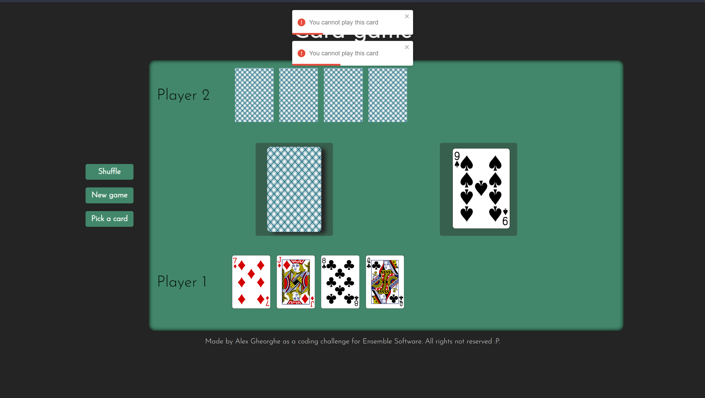
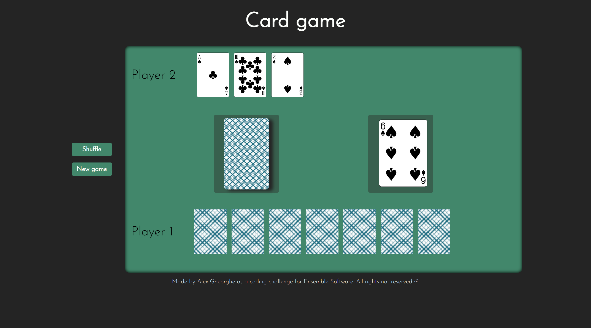
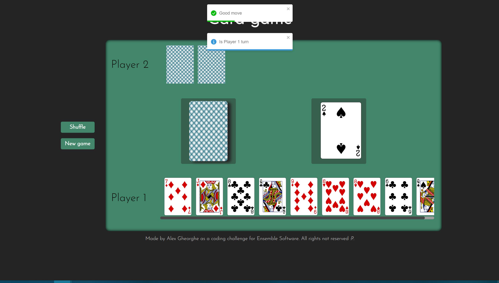
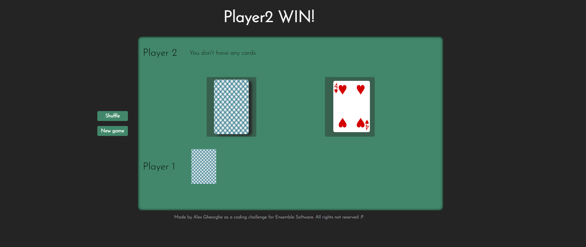

# Welcome to Macao Card Game app! <!-- omit in toc -->

Welcome to Macao Card Game app. This app emulates a card game similar to Uno that is played in Romania at parties, game nights etc.  This game is played by both players in the same window, oponent cards being not visibile to the player. 

The front end of the app is made using React.js and it was created with Vite.js for a speedy development experience. The API used for deck functionality is DeckofCardsAPI (https://deckofcardsapi.com/). The other dependencies are:
 - React-Toastify v9.0.8 (https://www.npmjs.com/package/react-toastify)
 - Axios v0.27.2 (https://axios-http.com/docs/intro)

# Table of Contents <!-- omit in toc -->
  [1. Installation](#1-installation)
  [2. Usage](#2-usage)
  [3. Future improvements](#3-future-improvements)

# 1. Installation

To install the application you need to clone this repository and run `npm install` to install the app and all the necessary dependencies. To run the application in dev mode you need to run `npm run dev` to start vite development server.

Other commands are:
- `npm run build` - build the app
- `npm run preview` - preview the app before build

# 2. Usage

When you start the application from the first time, a new deck will be generated in the API and it's ID will be stored in browser storage for further use. After generating the deck the app will notify you to shuffle the deck before the first game.

 If you run the app for the second time and over an ID will be already existing in storage and will be use. If that's the case, your card deck will be automatically shuffled.
 

After you press NewGame button, 5 cards will be distributted for every player, and a card will pe put on played cards surface. After you started a new game, you need to shuffle the cards before you can begin another game. Pressing the new game button will trigger a notification that tells you you need to reshuffle the deck first.

The card the player can put down can have the same value and different suit or can have any value but the same suit. If a 7 of spades was on the top of the discard pile, the player can play a 9 of spades or a 7 of clubs.

If you don't have a card to respect the rule mentioned above you can try clicking any card available in your hand. You will receive a notification error. After 2 notifications a "Pick a card" button will appear on the left-side of the screen. Clicking it will add a card in your pile and end your turn.

If a 2 is played, the next player in the sequence must pick up 2 cards unless they have a 2, in which case they will add this to the original 2 and the next player in the sequence must pick up 4 cards and so on. If a 3 is played, the next player in the sequence must pick up 3 cards unless they have a 3, in which case they will add this to the original 3 and the next player in sequence must pick up 6 cards and so on.

If a 4 or Ace is played, the next player in the sequence must miss a go, unless they have a 4 or an Ace (if Ace was played), in which case they will add this to the original 4 or Ace (if Ace was played) and the next player in sequence misses 2 goes.

When one of the players will finish the cards in hand a notification will appear with the player that won the game and the title will change accordingly.

# 3. Future improvements
- Drag and drop interface for moving player cards into played cards pile
- Better performance improvements to make more efficient API calls
- An implementation of global states with react redux may improve the app performance by reducing some of the state updates
- Make the card deck clickable instead of showing the "Pick a card" button 

# 4. App images
